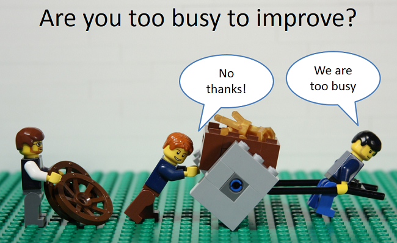

# Tech retro
  

> ### If you think good architecture is expensive, try bad architecture. ~ Brian foote and Joseph Yoder in *"Big ball of mud"*

* Gather your team
* Introspect and think about your architecture

If you are familiar with agile retrospectives you know that it is a meeting where the team reflects on what happened in the iteration and **identifies actions for improvement going forward**.  
It is dedicated on the work process.

In a technical retrospective, we are **focusing on the technical topics**.

## Technical retrospective questions 
During this meeting we need to address those kind of questions :
* Where are the defects ?
* Where are the 'hard bits' ? What makes them hard ?
* Where are the 'easy bits' ? What makes them easy ?
* What keeps changing ? Why ?
* What stays still ? Why ?
* ...

## Benefits
By introspecting regularly on your architecture, you will continuously improve at the technical level.  
You will use the **collective intelligence** of your team to do so. 

  
