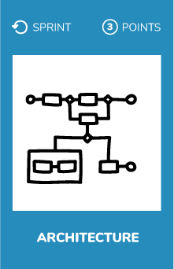
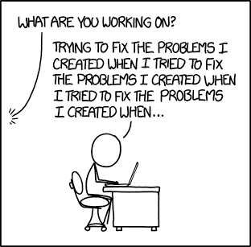
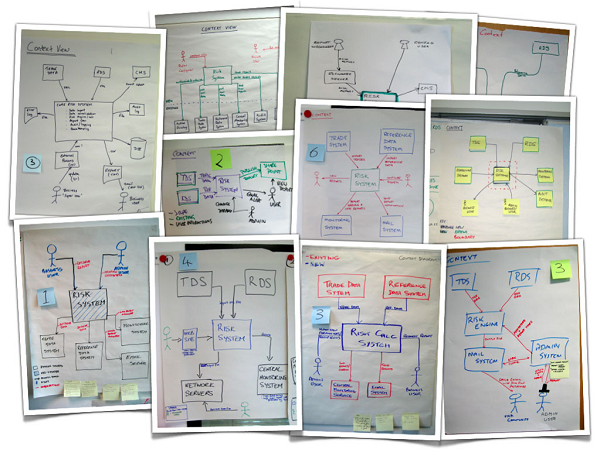

# Architecture

## What ?
The way that software components — subroutines, classes, functions, etc. — are arranged, and the interactions between them, is called architecture.  
In order to communicate it we need to represent it.

## Why ?
Architecture is everywhere in our code, in every piece of code. Representing it, it is a good way to validate that everyone has the same level of understanding about the architecture.  
Have a clear representation helps to have :
* Constructive technical discussions
* A technical alignment inside the team

## How ?
**1) In solo**
* Think about your current project
* Think about the architecture
* Draw a big picture diagram on a A4 paper sheet

**2) Team work**
* Ask to everyone in your team to do the same exercise
* Compare your visions

This kind of workshop will create **alignment**.  
It will also create a safe place to talk about the current architecture and maybe also about the **future things that needs to be addressed**.

## Our tips
> Forget what you have learned about modeling language such as UML, Merise or others. Here we just want to create alignement so do not add any complexity.

## Resources
* [Interesting talk about how to represent your architecture](https://www.youtube.com/watch?v=oDpdaXt0HQI) by Simon Brown
* [Visualize, Document, and Explore Your Software Architecture](https://academy.realm.io/posts/gotocph-simon-brown-visualize-document-explore-your-software-architecture/)
