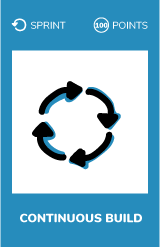
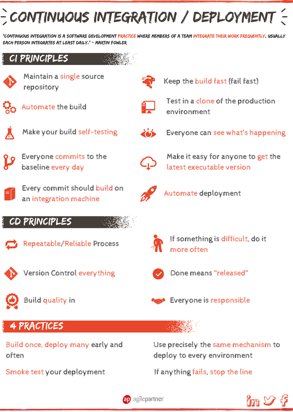

# Continuous build
  

## What ?
Software development is done in teams.  
`Continuous Integration (CI) is the process of automating the build and testing of code every time a team member commits changes to version control.`

One rule needs to be followed when you continuously integrate :  
> If anything fails, **stop the line**!

## Why ?
Because you’re integrating frequently, there is significantly less back-tracking to discover where things went wrong, so you can spend more time building features.

Continuous Integration is cheap.  
Not integrating continuously is expensive. If you don’t follow a continuous approach, you’ll have longer periods between integrations.  
This makes it exponentially more difficult to find and fix problems. Such integration problems can easily knock a project off-schedule, or cause it to fail altogether.

Continuous Integration brings multiple benefits :
* Say goodbye to long and tense integrations
* Increase visibility enabling greater communication 
* Catch issues early and nip them in the bud
* Spend less time debugging and more time adding features
* Build a solid foundation
* Stop waiting to find out if your code’s going to work
* Reduce integration problems allowing you to deliver software more rapidly

  

## How ?
In order to understand what is built by other teams in your company, **fix the next broken continuous build** of another team.  
Continuous build could have been broken by :
* A compilation issue
* Failed test(s)  

If no CI configured :
* Configure it with Jenkins, VSTS or whatever (you can find plenty of tools)

  

## Resources
* [Continuous integration by Thoughtworks](https://www.thoughtworks.com/continuous-integration)
* [9 benefits of Continuous Integration](https://dzone.com/articles/9-bene-ts-of-continuous-integration)
* [Continuous Integration for Amazon](https://aws.amazon.com/devops/continuous-integration/)
* [Continuous Integration for Microsoft](https://www.visualstudio.com/learn/what-is-continuous-integration/)
