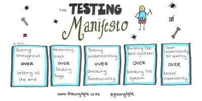

# Exploratory testing

Organize regularly exploratory testing sessions. (1 by sprint for example)

## What is it ?
Exploratory testing is an approach to software testing that is concisely described as simultaneous learning, test design and test execution.   
Exploratory testing seeks to find out **how the software actually works**, and to ask questions about how it will **handle difficult and easy cases**.  
The quality of the testing is dependent on the tester's skill of inventing test cases and finding defects. The more the tester knows about the product and different test methods, the better the testing will be.

> ### Because it **leverages human intelligence**, Exploratory Testing gives you a broader and deeper view than any automated test could.

## Benefits
* Helps you expose defects that automated and manual testing miss
* Helps many different team members collaborate to expose more types of defects
* Lets you find functional defects when automated testing is not viable

Basically, it will help you to **provide high quality software**. Exactly what a software craftsman wants for his clients. 

## Resources
* [The testing manifesto](https://www.growingagile.co.za/2015/04/the-testing-manifesto/)
* [Agile tests pyramid](https://martinfowler.com/bliki/TestPyramid.html)
* [Agile testing quadrants](http://www.cigniti.com/blog/agile-test-automation-and-agile-quadrants/)

