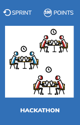

# Hackathon

* Find sponsors to organize the event
* Schedule an internal hackhathon
* Gather your colleagues
* Make some noise about it (create the buzz)

## What is it ?
> ### “A hackathon, a hacker neologism, is an event when programmers meet to do collaborative computer programming.”
Hackathons provide a venue for self-expression and creativity through technology. People with technical backgrounds come together, form teams around a problem or idea, and collaboratively code a unique solution from scratch — these generally take shape in the form of websites, mobile apps, and robots. 

## Benefits
* Learn new technical skills
* Create a sense of accomplishment
* Innovate
* Develop solving problems skills

## Resources
* [The design sprint](http://www.gv.com/sprint/) : How to solve big problems and test new ideas in just five days
* [Hackhathon guide](https://hackathon.guide/)
* [Lessons learned from organizing a hackhathon](https://thenextweb.com/entrepreneur/2015/09/27/7-lessons-learned-from-organizing-a-hackathon/)
* [Hachathon planning](https://techcrunch.com/2012/03/31/hackathon-planning/)
* [6 key tips to organize a hackhathon](https://www.techrepublic.com/article/how-to-organize-a-hackathon-6-key-tips/)

