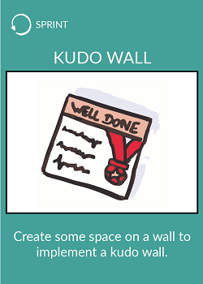
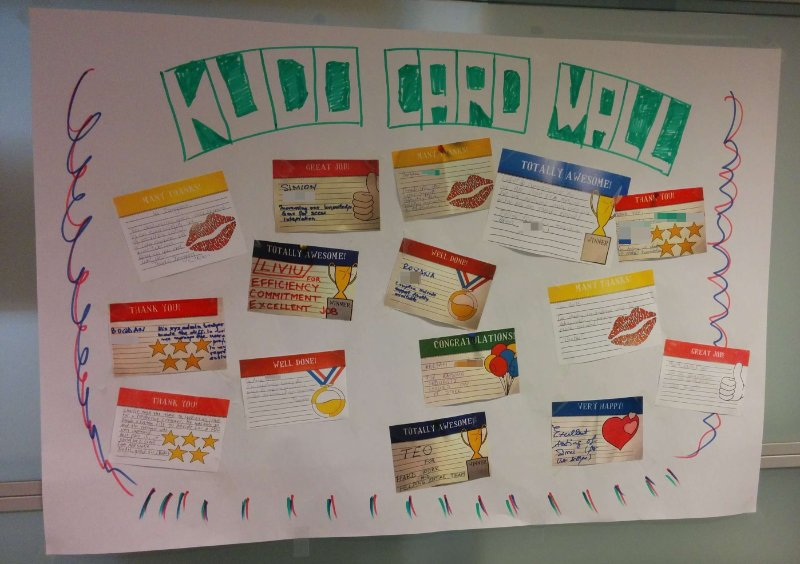

# Implement a kudo wall

> ## Kudo Cards are small gestures of gratitude.

* Create space on a wall
* Name it Kudo wall
* Invite people to offer each other tokens of appreciation by putting them on this wall

Those tokens are called kudo cards.

