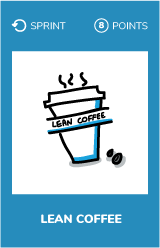
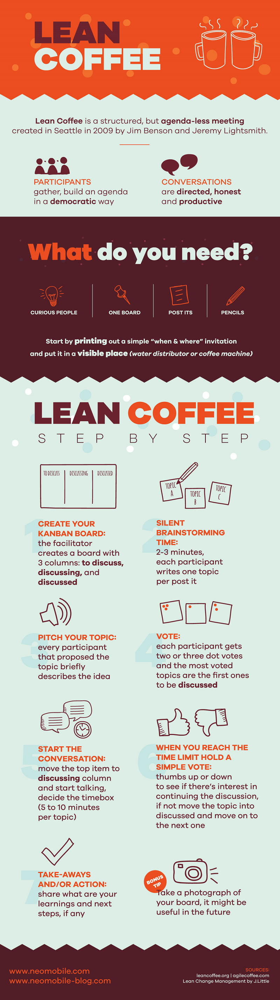

# Lean coffee

## What ?
Lean Coffee is a gathering of a small number of people who want to discuss topics in an informal setting. 
Lean Coffee is a structured, but agenda-less meeting.  
Participants :
* Gather
* Build an agenda
* Begin talking  

Conversations are **directed and productive because the agenda for the meeting was democratically generated**.  
The Lean Coffee format is **easy to learn and easy to facilitate**.  
As you might guess from the name, it combines Lean Thinking (often embodied in Lean Startup) with the idea of meeting in an informal gathering place like a coffee shop, a conference room, or an open space.

## Why ?
Lean coffee is a free-space workshop where people can :
* Talk about what is important inside the
    * Team
    * Organization
* Decide how long we discuss each topic
* Share experiences and challenges
* Solve problems in a collective way
* Collaborate

## How ?
* Prepare yourself to facilitate it
* Schedule a session
* Gather your colleagues
* Facilitate the session
* Debrief at the end

### How to facilitate a session ?
#### 1) Create a Kanban board
Write the following words/phrases on three separate note cards or sticky notes: “To Do,” “Doing,” “Done” (or alternatively, “To Discuss,” “Discussing,” “Discussed”)
#### 2) Brainstorm topics
Everyone writes down topics they would like to discuss (usually one topic per sticky note) before placing them in the middle of the table or on a nearby wall. This should take only a few minutes.
#### 3) Pitch topics
Once the group and/or facilitator thinks there are enough topics on the table, each idea will have a one or two sentence introduction. The aim is to clarify the topic to the other people; not to discuss them at this stage.
#### 4) Vote
Everyone votes on the topic(s) they would like to discuss by dot voting: each person gets two votes to choose which topic(s) they would like to discuss. People can put both dots on the same topic, or on different ones.
#### 5) Prioritize topics
The dots on each topic are counted, and the topics are sorted into popularity order in the ‘To discuss’ column of the kanban board.
#### 6) Discussion
The most popular topic is then discussed for 8 minutes. As a discussion starts, the sticky note for that topic is moved into the ‘Doing‘/‘Discussing’ column.
#### 7) Continue or not ?
At the end of 8 minutes, the group votes whether to continue with the same topic or move onto the next.  
Voting is usually conducted through a thumbs up versus thumbs down approach (**roman vote**).  
If the topic continues, you continue for another 4 minutes, then re-vote.
#### 8) Topic is finished
When the topic is finished, the sticky note for that topic is moved into the ‘Discussed’ column and you move onto the next most popular topic.
#### 9) Repeat
Repeat above steps on each topics

## Resources
* [How to hack your meetings](http://www.neomobile.com/multimedia/lean-coffee-how-to-hack-your-meetings/)
* [Facilitator's guide](https://medium.com/agile-outside-the-box/lean-coffee-facilitator-s-guide-d79d9f13d0a9)
* [leancoffee.org](http://leancoffee.org/)
