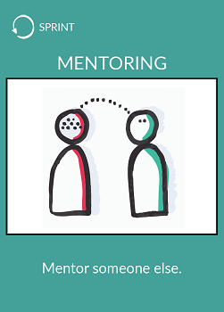

# Mentoring

## What ?
Mentoring is a powerful personal and career development tool that can enable the mentee to **achieve or exceed their life's goals and aspirations**.  
> ### *According to a lot of definition a mentor is **'a trusted counselor or guide'***. 

### What does a mentor do? 
Well it will always depend upon the mentee's needs a mentor:
* Shares knowledge and life experiences
* Provides guidance and advice
* Listens
* Inspires
* Offers encouragement
* Is genuinely interested in the mentees questions and concerns
* Is open and honest
* Explores different careers
* Discusses goal setting
* Advises on professional development
* Helps to develop leadership skills
* Provides insight into corporate culture
* Can provide exposure and visibility within an organization
* Coaches
* Supports

## Why ?
Mentoring has plenty of benefits :

### **For mentee**
* Exposure to new ideas and ways of thinking
* Advice on developing strengths and overcoming weaknesses
* Guidance on professional development and advancement
* Increased visibility and recognition within the company
* The opportunity to develop new skills and knowledge

### **For mentor**
* Recognition as a subject matter expert and leader
* Exposure to fresh perspectives, ideas and approaches
* Extension of their professional development record
* Opportunity to reflect on their own goals and practices
* Development of their personal leadership and coaching styles

### **For the company**
* Develop a culture of personal and professional growth
* Share desired company behaviours and attitudes
* Enhance leadership and coaching skills in managers
* Improve staff morale, performance and motivation
* Engage, retain and develop performers

## How ?
* Find someone to mentor in your company
* Ask him/her if he wants to be mentored by you
* Start to mentor him/her
    * See you on a regular basis
    * Discuss/let him introspect him/herself
    * Ask feedbacks about how to improve the session

## The M.E.N.T.O.R model
If you want to succeed in a mentoring relationship we recommend to follow the principles explained in the M.E.N.T.O.R model (explained in the book *"One minute mentoring"* by Ken Blanchard and Claire Diaz-Ortiz)

| Topic | Take action | Sound bite | Notes |
| --- | --- | --- | --- |
| **M**ission | Essential to :  • Create a vision • Purpose For the future mentoring partnership | First step in any relationship = **have a clear mission statement** | • Find a mentor who shares your key values • Approach a prospective mentor or mentee with courtesy / respect • Develop a short mission statement to set your intention and direct the relationship • Mentoring adds value on both sides (Mentees have knowledge and ideas to offer mentors as well)
| **E**ngagement | Agree on ways to engage that work for your : • Personalities • Schedule | Make a **commitment on regular meetings** | • Determine the type of engagement that works best for your personalities   - Is your mentor / mentoree an extrovert / introvert ? - Are they best with set times scheduled far in advance ? • Mentoring partnerships require both : - Flexibility to engage in digital communication  - The power in-person meetings when possible |
| **N**etworking | Expand your network with that of your mentor or mentee. | Cultivating productive relationships is a major key to success | • Networking is a **two-way street** - Your mentor can broaden your connections • Tread carefully on the network of your mentoring partner • Mentoring is also 1 to many connections (Social media for example) |
| **T**rust | Build and maintain trust by :  • Telling the truth • Staying connected | **Building trust takes time -> can be destroyed in an instant** | • Trust should deepen  • Honesty and clear communication with your mentoring partner can deepen trust and take your relationship to the next level |
| **O**pportunity | **Create opportunity for your mentoree or mentor to grow** | As partners you have access to personal and business opportunities | • Mentoring partnership is a two way street (Both have opportunities to bring) • Mentoring between generations (cross generational mentoring) -A powerful way to create opportunities by exchanging |
| **R**eview and Renewal | **Schedule a regular time to** • Review progress • Renew your mentoring partnership | You'll never get where you want if you don't create a mission statement and you'll never know you've arrived if you don't do regular reviews. | • Scheduling a regular review keeps both mentor and mentee on track  • Ensure that reviews take place by putting them into your calendar • If your review reveals that the mission has not been accomplished -> discuss new strategies to achieve the goal | 

## Resources
* [Good mentor qualities](http://lrsuccess.com/qualities-good-mentor/)
* [7 key qualities of an effective mentor](https://www.inc.com/jayson-demers/7-key-qualities-of-an-effective-mentor.html)
* [How to use mentoring in your workplace](https://chronus.com/how-to-use-mentoring-in-your-workplace)
