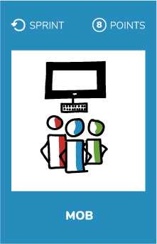
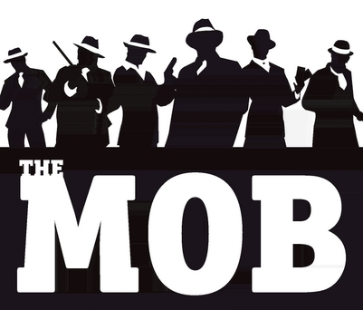

# Mob

> ## "Resolve complex problems in whole team"

* Gather your team
* Schedule a meeting with your Product Owner
* Mob program with your Product Owner

## Resources
* Getting started [guide](https://www.agileconnection.com/article/getting-started-mob-programming)
* See this [video](https://www.youtube.com/watch?v=dVqUcNKVbYg) to understand how to organize a mob session
* [Mob programming role cards](https://github.com/willemlarsen/mobprogrammingrpg)
* [Mob roles at Cucumber](https://cucumber.io/blog/2017/10/16/five-roles-in-a-healthy-mob)

