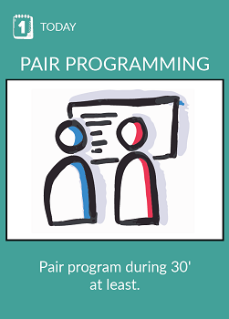
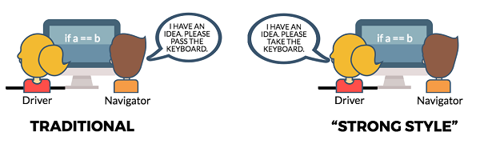

# Pair programming

## What ?
Pair programming consists of two programmers sharing a single workstation.  
There are 2 roles in pair programming :

#### Driver
The programmer at the keyboard is called the Driver.

#### Navigator
The other is called the Navigator.  
He is involved in the programming task by focusing more on overall direction. While reviewing, the navigator also considers the "strategic" direction of the work, coming up with ideas for improvements and likely future problems to address.  
This is intended to free the driver to focus all of their attention on the "tactical" aspects of completing the current task, using the observer as a safety net and guide.

> ### “For an idea to go **from your head** to the computer it **must go through someone else’s hands**”

## Why ?
* **Better code so better quality**  
"Programming out loud" leads to clearer articulation of the complexities and hidden details in coding tasks, reducing the risk of error or going down blind alleys.
* **Mentoring/Knowledge sharing/Shared understanding**  
Everyone, even junior programmers, has knowledge that others don't. Pair programming is a painless way of spreading that knowledge.
* **Improved morale**  
Pair programming, done well, is much more enjoyable than programming alone, done well.
* **Collective code ownership**  
When everyone on a project is pair programming, and pairs rotate frequently, everybody gains a working knowledge of the entire codebase.
* **Improve team coordination**  
There are N/2 pairs to coordinate instead of N individual developers.

## How ?
* Find someone in your team to pair program
* Start to program in pair
    * Start as driver
    * Change the roles every 5 minutes
* Do it during at least 30 minutes
* Debrief with your team mate and your team

## Resources
* [Pair programming explained](https://www.agilealliance.org/glossary/pairing/#q=~(filters~(postType~(~'page~'post~'aa_book~'aa_event_session~'aa_experience_report~'aa_glossary~'aa_research_paper~'aa_video)~tags~(~'pair*20programming))~searchTerm~'~sort~false~sortDirection~'asc~page~1))
* [Effective pair programming](https://medium.com/@joonty/effective-pair-programming-601abb6b9fa)
* [Pair programming in XP](http://www.extremeprogramming.org/rules/pair.html)
* [Best practices](https://github.com/andela/bestpractices/wiki/Pair-Programming)
* [Pair Programming: 7 Habits of Highly Effective Coders](https://www.youtube.com/watch?v=5ySLQ5_cQ34&t=116s)
* [Agile in practice: Pair programming](https://www.youtube.com/watch?v=ET3Q6zNK3Io)

## Share
[ Share this challenge](https://twitter.com/home?status=I%20have%20just%20completed%20Pair%20programming%20%23craft_challenges%20from%20%40agilepartner%20http://tiny.cc/p7v5vy)