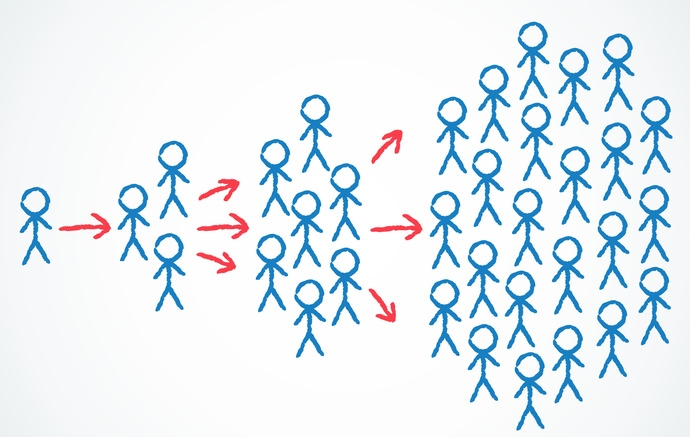
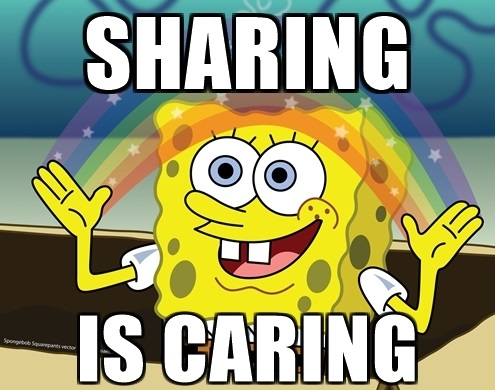

# Share
  

## What ?
Organizations increasingly use teams as a basis for structuring work and decision-making. A central reason for utilizing a multi-person format for making decisions is for reaching decisions of higher quality than possible by a single individual.  
A key ingredient to successful team-based decision-making is the **sharing** among members.  
**How, and what, information is shared between members greatly impacts the team’s decision-making ability.** 

Knowledge sharing for example is a critical component of teams efficiency. Knowledge sharing is the process by which individuals exchange tacit and explicit knowledge in order to create new knowledge.
It can occur between individuals, within teams and across the organization. 

> Knowledge sharing is a critical team process that involves members interacting to share ideas, information, and suggestions relevant to the team's task at hand.

## Why ?
By connecting and sharing with people you will increase trust in and outside the team.  
It you will create new knowledge as well.  

> ### In agile we strongly believe in *"Individuals and interactions over processes and tools"*.

## How ?
* Take some time to share/discuss with people involved in your current project (users, business experts, team colleague)
* Share your :
    * Knowledge
    * Latest discoveries
    * Latest challenges
    * ...

## Resources
* [How the Sharing of Information Affects Team Performance](http://www.degarmo.com/how-the-sharing-of-information-affects-team-performance)
* [Team Knowledge Sharing as a Competitive Advantage](https://www.sesp.northwestern.edu/masters-learning-and-organizational-change/knowledge-lens/stories/2012/knowledge-sharing-leveraging-trust-and-leadership-to-increase-team-performance.html)
* [Ways of Sharing Knowledge On Agile Teams](https://www.frontrowagile.com/blog/posts/86-ways-of-sharing-knowledge-on-agile-teams)

