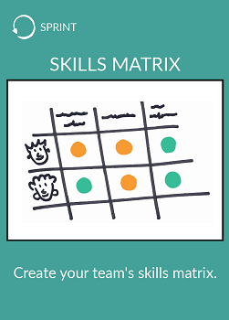
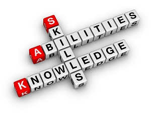

# Skills matrix

## What ?
A skills matrix is a grid or **table that clearly and visibly illustrates the skills and competence held by individuals within a team**. 
The aim is to help team members understand each other’s skills, abilities and ambitions.

## Why ?
Skills matrix will help you to answer those questions:  
* Which competences, skills and abilities are already in the team ?
* Which competencies, skills, and abilities do you possess that may not be relevant to the goal of the team ?
* Which competences and so forth would you like to achieve or learn from some of the other team members ?

Once you have answers to those questions you can :
* Define how to share people's knowledge
* Identify what are the missing skills that are needed to reach the goal of the team
* Measure the skills improvement of the team

## How ?
* Schedule a skills matrix meeting
    * Prepare you to facilitate the meeting
    * Gather your team
    * Facilitate the meeting
    * Debrief
* Structure the result/skills matrix (in Excel for example)
* Communicate it
* Define a training strategy based on it

## Resources
* [Facilitator's guide](https://medium.com/practicalscrum/market-of-skills-634a6ebf3363)
* [Team LiftOff with Market of Skills and Competence Matrix](https://blog.crisp.se/2012/11/06/anderslaestadius/team-liftoff-with-market-of-skills-and-competence-matrix)

## Share
[ Share this challenge](https://twitter.com/home?status=I%20have%20just%20completed%20the%20Skills%20matrix%20%23craft_challenges%20from%20%40agilepartner%20http://tiny.cc/p7v5vy)