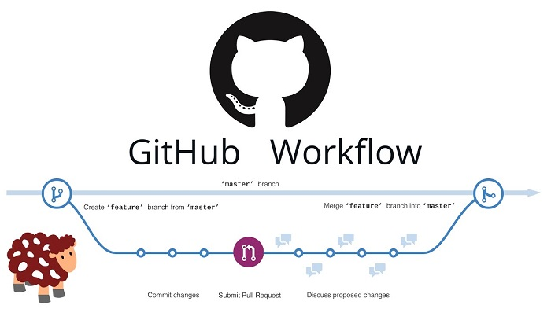

# Source control
  

* Make at least 1 pull request / day 
* Do it during the next 4 days at least

> ### Pull requests will allow you to do pair reviews in your team.

## What is it ?
Pull requests let you tell others about changes you've pushed to a git repository.  
Once a pull request is opened, you can **discuss and review the potential changes** with collaborators and add follow-up commits before the changes are merged into the repository.

## How to 
Create a pull request to propose and collaborate on changes to a repository.  
These changes are proposed in a branch, which ensures that the master branch only contains finished and approved work.

## Resources
* [How to make a pull request](https://www.atlassian.com/git/tutorials/making-a-pull-request)
* [git-pull documentation](https://git-scm.com/docs/git-pull)
* [Deployment by pull requests](https://www.madetech.com/blog/deployment-by-pull-requests)

